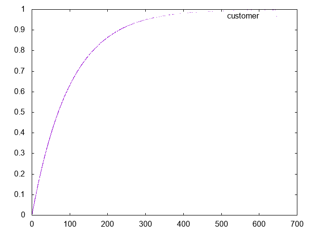
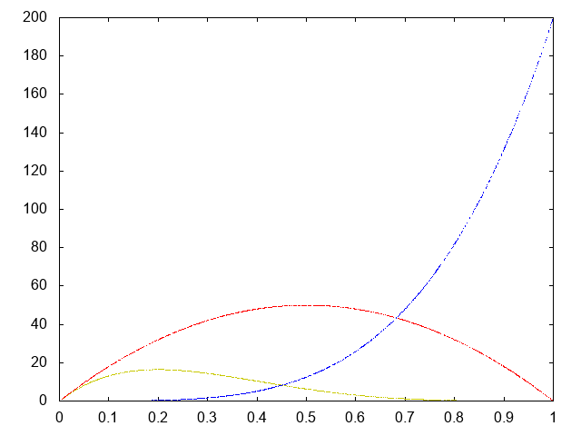

#Bank Simulation
To run this script, open a terminal and enter:

``` bash
$ stack BankSimulation.hs
```
Or alternatively:

``` bash
$ chmod +x BankSimulation.hs
$ ./BankSimulation.hs
```

Uncomment a few lines to generate these plots:

<p align="center">


</p>
